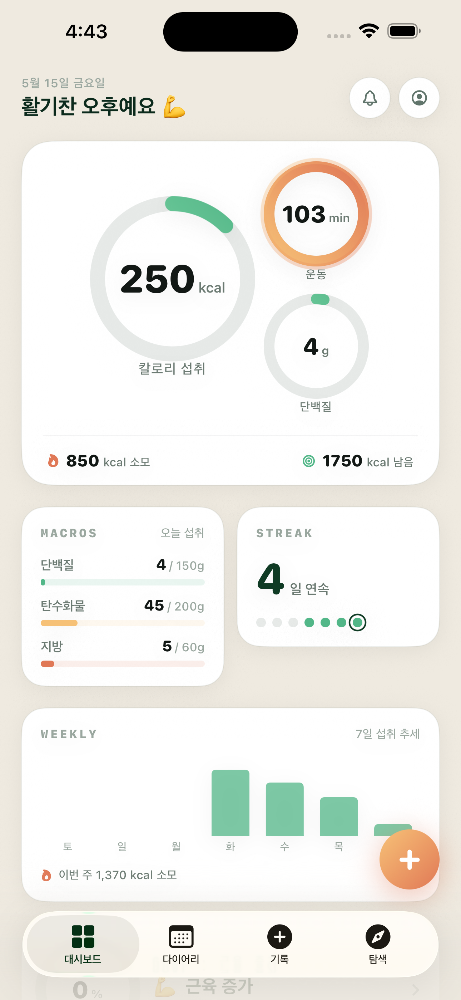
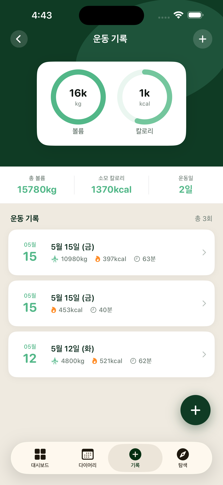
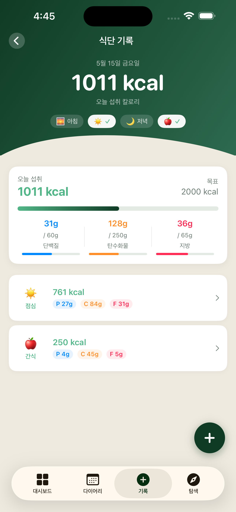
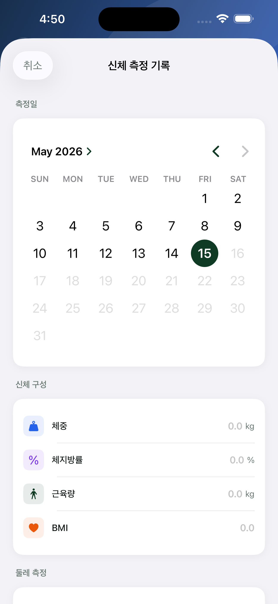
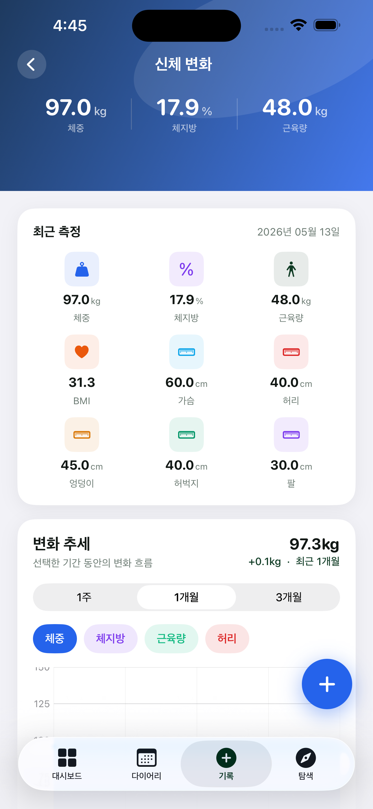
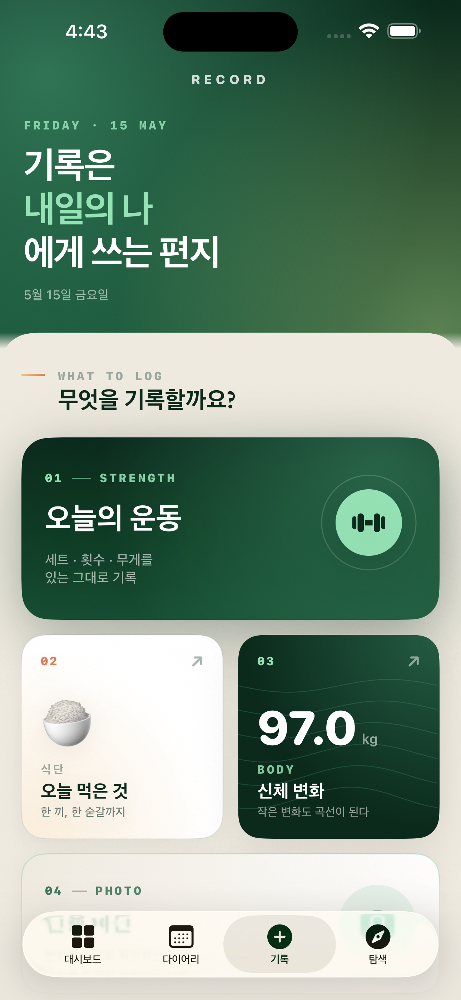
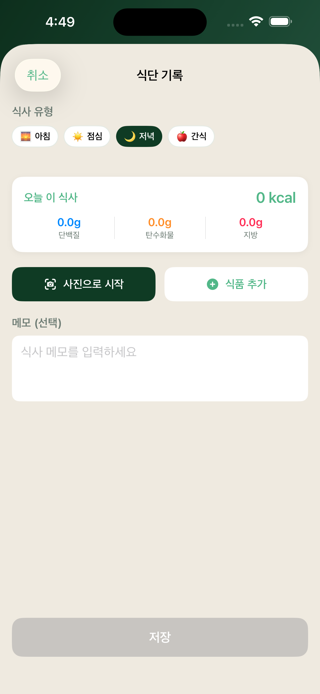
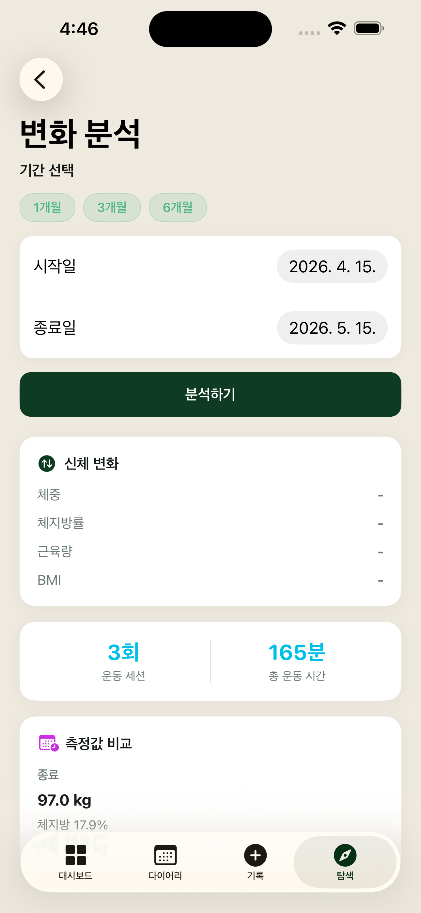
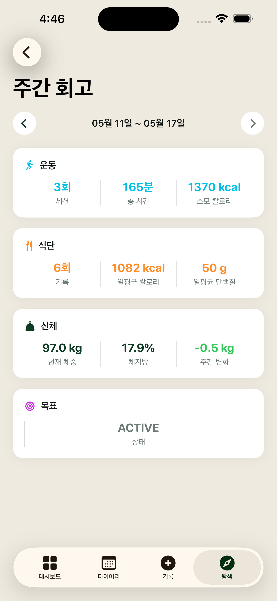

# Gainsy

> 운동·식단·신체 변화를 한 곳에서 기록하고, 주간 회고로 목표 달성을 돕는 iOS 헬스 트래킹 앱

[](https://github.com/KimGiii/Gainsy/actions/workflows/ci-backend.yml)
[](https://github.com/KimGiii/Gainsy/actions/workflows/ci-ios.yml)


App Store 출시: **`api.gainsy.site`** · 운영 중

---

## Gainsy를 한 줄로

운동·식단·신체 측정·진행 사진·목표를 한 앱 안에서 끊김 없이 잇고, **AI 기반 식단 분석**과 **주간 회고**로 변화를 가시화하는 헬스케어 서비스. iOS(SwiftUI) + Spring Boot(Java 21) + AWS 스택으로 구성된 풀스택 프로젝트입니다.

---

## 스크린샷

| 홈 대시보드 | 운동 기록 | 식단 기록 | 신체 측정 | 목표 |
|:-----------:|:---------:|:---------:|:---------:|:----:|
|  |  |  |  |  |

| 기록 메인 | 식단 기록 상세 | 변화 분석 | 주간 회고 |
|:---------:|:--------------:|:---------:|:---------:|
|  |  |  |  |

---

## 주요 기능

### 🏋️ 운동 기록
- 근력·유산소·기타 세션 기록, 종목별 세트/횟수/무게 추적
- 운동 카탈로그 110개 (근육군별 분류) + 사용자 커스텀 운동
- 사용 빈도 기반 검색 정렬 — 자주 쓰는 운동 우선 노출

### 🥗 식단 기록
- 공공 식품 영양 DB + 사용자 커스텀 식품
- **AI 사진 분석** (OpenAI GPT-4.1-mini Vision) — 식사 사진 한 장으로 영양소 자동 추정
- 사용 빈도 기반 검색 정렬

### 📊 신체 측정 & 진행 사진
- 체중·체지방률·근육량 등 5개 지표 기간별 추세 그래프
- S3 기반 진행 사진 업로드 (Presigned URL · 15분 TTL · EXIF 제거 · 썸네일 자동 생성)
- 날짜 범위로 변화 비교

### 🎯 목표 & 주간 회고
- 체중 감량 / 근육 증가 / 체성분 / 지구력 / 일반 건강 — 목표 유형별 진행률 추적
- 주간 체크포인트 자동 생성, 일정 대비 ON_TRACK / SLIGHTLY_BEHIND / BEHIND 상태 표시
- 매주 월요일 FCM 푸시로 회고 요약 전달

### ♿ 접근성 & UX
- 다크/라이트 모드 완전 지원 (Forest 톤 어댑티브 컬러)
- Dynamic Type, VoiceOver, PrivacyInfo.xcprivacy
- Pull-to-refresh, 세션 만료 자동 로그아웃, 진행 사진 업로드 실패 fallback/재시도 UX

---

## 기술 스택

| 영역 | 기술 |
|------|------|
| **iOS** | Swift 6.0, SwiftUI, MVVM, strict concurrency (actor model), Combine |
| **Backend** | Spring Boot 3.3.4, Java 21 (Virtual Threads), JPA/Hibernate, Flyway |
| **DB / Cache** | PostgreSQL 16, Redis 7 |
| **인증** | JWT — Access Token **1h** · Refresh Token 30d, Keychain 저장 |
| **스토리지** | AWS S3 (Presigned URL · 15분 TTL · 사용자별 prefix 검증) |
| **푸시 알림** | Firebase FCM (주간 회고 자동 발송) |
| **AI** | OpenAI GPT-4.1-mini (식단 사진 분석, 영양 추정) |
| **인프라** | AWS — EC2 t3.small · RDS PostgreSQL · ElastiCache Redis · S3 · ECR |
| **IaC** | Terraform, Nginx 리버스 프록시, Let's Encrypt SSL (자동 갱신) |
| **CI/CD** | GitHub Actions — backend / iOS / dev→prod 자동 배포 |
| **로컬** | Docker Compose (PostgreSQL · Redis · LocalStack S3) |

---

## 아키텍처

```
┌─────────────────────────────────────────────┐
│              iOS (SwiftUI)                  │
│  Features → ViewModel → APIClient (JWT)     │
│       자동 refresh · 401 재시도 · Keychain   │
└─────────────────┬───────────────────────────┘
                  │ HTTPS
                  │ api.gainsy.site
┌─────────────────▼───────────────────────────┐
│  Nginx (TLS, HSTS, X-Forwarded-*)           │
└─────────────────┬───────────────────────────┘
                  │
┌─────────────────▼───────────────────────────┐
│         Spring Boot API Server              │
│  JwtAuthFilter → RateLimitFilter →          │
│  Controller(@CurrentUserId) → Service       │
│  → Repository(JPA, @Transactional)          │
│  ├── PostgreSQL 16  (영속 데이터, Flyway)    │
│  ├── Redis 7        (캐시 · 토큰 블랙리스트) │
│  ├── S3             (사진, Presigned URL)   │
│  ├── OpenAI         (식단 사진 분석)         │
│  └── Firebase FCM   (주간 회고 푸시)         │
└─────────────────────────────────────────────┘
```

상세 설계 결정은 [ARCHITECTURE.md](./ARCHITECTURE.md), [API 설계](./docs/design-docs/API_DESIGN.md), [DB 스키마](./docs/design-docs/DB_SCHEMA.md)를 참고하세요.

---

## 보안·품질

운영 중 발견된 이슈는 코드 리뷰 회고로 추적하며, 정기적으로 정리합니다.

### 인증·인가
- 컨트롤러는 토큰을 직접 파싱하지 않고, `JwtAuthenticationFilter`가 세팅한 `SecurityContext`를 `@CurrentUserId` 어노테이션으로 단일 진입점에서 추출 — 검증 우회 위험 차단
- Access Token TTL **1시간**(이전 24h) · Refresh Token 30일 · iOS 클라이언트는 만료 30초 전 선제 refresh + 401 시 1회 재시도 + 동시 호출 단일 refresh 보장
- JWT 시크릿은 환경변수 강제 (기본값 없음, 미설정 시 시작 단계 실패)

### 네트워크·웹 보안
- **CORS** — 와일드카드 금지, 환경별 명시 (`https://api.gainsy.site` 등). 누락 시 시작 실패
- **Security headers** — HSTS (1년 + includeSubDomains + preload), `X-Content-Type-Options: nosniff`, `X-Frame-Options: DENY`, `Referrer-Policy: strict-origin-when-cross-origin`
- **Rate limiting** — `/api/v1/auth/**`에 분당 20회 IP 기반 제한. X-Forwarded-For 헤더 무신뢰 (Nginx의 `forward-headers-strategy: native`가 신뢰된 프록시 IP를 `getRemoteAddr()`에 반영)

### 영속성·트랜잭션
- 조회 API는 순수 readOnly — 동시 GET 요청에서 중복 INSERT가 발생하지 않도록 GET 경로에서 DB 쓰기 금지
- 목표 체크포인트 누락 보정은 별도 스케줄러(`GoalCheckpointScheduler`, KST 03:00 매일)로 분리. 목표별 try/catch + 별도 트랜잭션으로 단일 실패가 다른 목표에 전파되지 않음
- 외부 HTTP 호출(FCM 등)은 DB 트랜잭션 밖에서 실행 — 단일 타임아웃이 전체 작업을 막지 않도록 분리

### 입력 안전성
- 모든 페이징 엔드포인트는 공통 `PageRequests` 유틸을 통해 `size` 최대 100 강제 (악성 `size=100000` 차단)
- DTO `@Valid` + 글로벌 `GlobalExceptionHandler`로 400/422 응답 표준화

### App Store 대응
- App Store 심사 거절 3건(Guideline 1.4.1 / 2.1 / 2.5.1) 코드 반영 후 재제출 통과
- 만 14세 미만 가입 제한, Privacy Labels, ATT 사전 설명 화면, 의료 출처 고지 (`MedicalSourcesView`)

### 테스트
- 백엔드 단위·컨트롤러 테스트 — JUnit 5 + Mockito + AssertJ
- 컨트롤러 테스트는 `MockMvc.standaloneSetup` + `CurrentUserIdArgumentResolver` + `SecurityTestSupport`로 인증 컨텍스트 주입
- iOS XCUITest — 핵심 플로우(운동·식단·신체 측정 진입 + Add 폼 시나리오) 9개

자세한 회고는 [`docs/retrospectives/2026-05-21-backend-code-review.md`](docs/retrospectives/2026-05-21-backend-code-review.md) 참고.

---

## 프로젝트 구조

```
gainsy/
├── backend/
│   └── src/main/java/com/healthcare/
│       ├── common/          # 예외, 응답 래퍼, 설정, 알림, rate limit, 페이징 유틸
│       ├── security/        # JWT, @CurrentUserId 리졸버, Spring Security 통합
│       └── domain/
│           ├── auth/        # 로그인, 회원가입, 토큰 갱신/회수
│           ├── user/        # 사용자 프로필
│           ├── exercise/    # 운동 세션, 세트, 카탈로그
│           ├── diet/        # 식단, 식품, 외부 식품 API, AI 사진 분석
│           ├── bodymeasurement/  # 신체 지표, 진행 사진
│           ├── goals/       # 목표 설정, 체크포인트, 스케줄러
│           └── insights/    # 주간 회고, 변화 분석
├── ios/HealthCare/
│   ├── Core/                # 네트워크(APIClient), 인증(AuthState), 저장소(Keychain)
│   ├── DesignSystem/        # 어댑티브 컬러 토큰, 공통 컴포넌트
│   ├── Features/            # Auth / Home / Exercise / Diet / Progress / Goals / Profile
│   └── Navigation/          # 탭 네비게이션
├── infra/                   # Terraform — VPC, EC2, RDS, ElastiCache, S3, ECR
├── docs/                    # PRD, API 설계, DB 스키마, 현재 상태, 회고
└── .github/workflows/       # CI/CD 파이프라인
```

---

## 문서

| 문서 | 내용 |
|------|------|
| [현재 상태](./docs/CURRENT_STATUS.md) | 구현 진행률, 최근 변경사항, 남은 작업 |
| [아키텍처](./ARCHITECTURE.md) | 시스템 설계, 기술 결정 이유 |
| [API 설계](./docs/design-docs/API_DESIGN.md) | REST 엔드포인트 명세 |
| [DB 스키마](./docs/design-docs/DB_SCHEMA.md) | PostgreSQL 테이블 설계 |
| [PRD](./docs/design-docs/PRD.md) | 제품 요구사항 |
| [화면 구조](./docs/design-docs/MVP_SCREEN_STRUCTURE.md) | 네비게이션 및 화면 흐름 |
| [코드 리뷰 회고](./docs/retrospectives/2026-05-21-backend-code-review.md) | 보안·트랜잭션 정리 작업 내역 |

---

## License

이 저장소는 개인 포트폴리오 목적으로 공개되어 있으며, 별도 라이선스가 명시되지 않은 한 모든 권리는 저작자에게 귀속됩니다.
